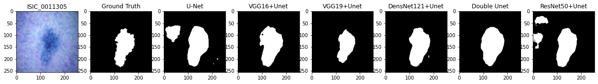
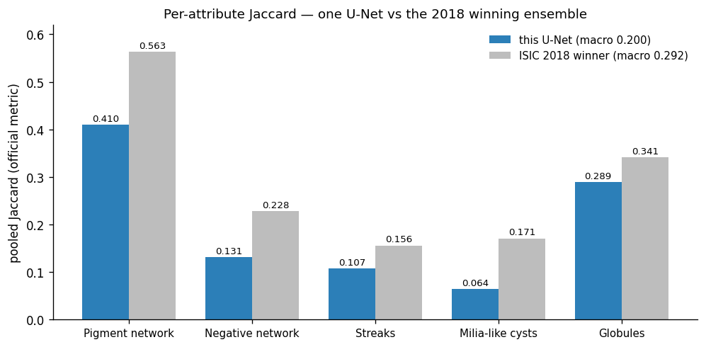
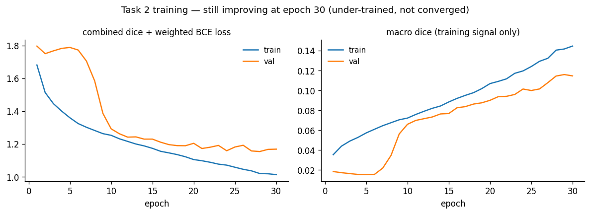
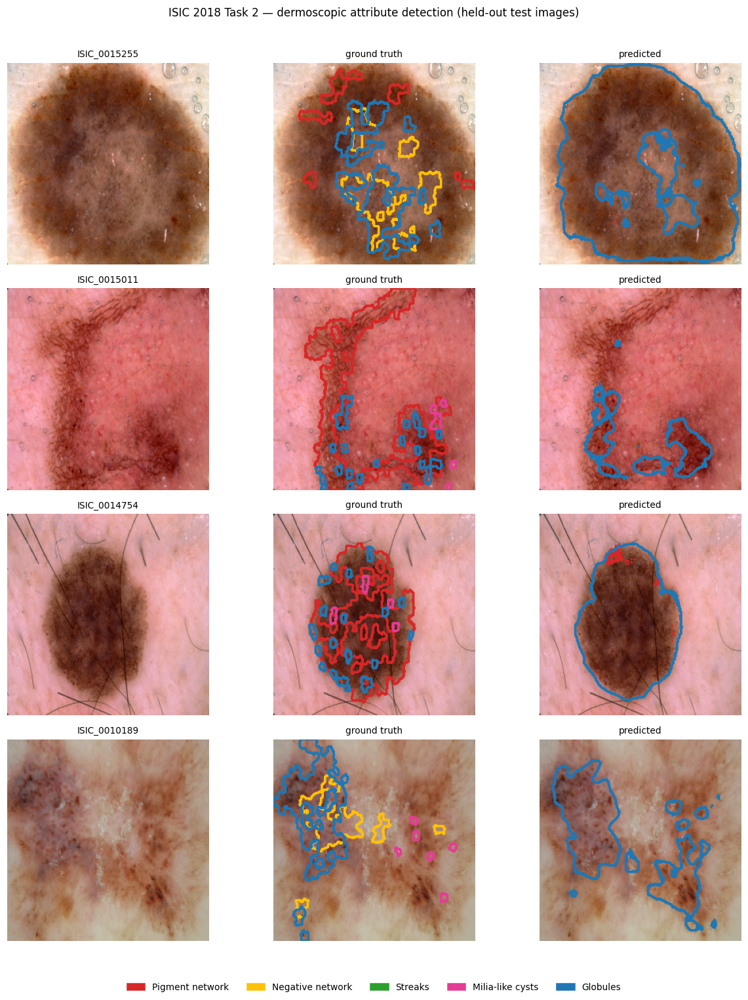
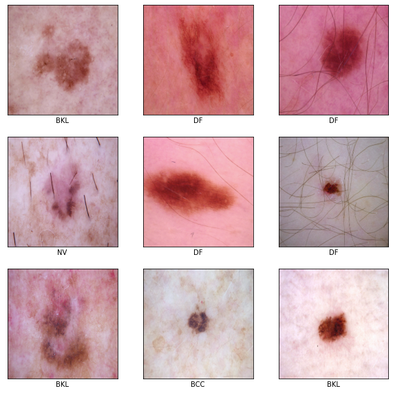
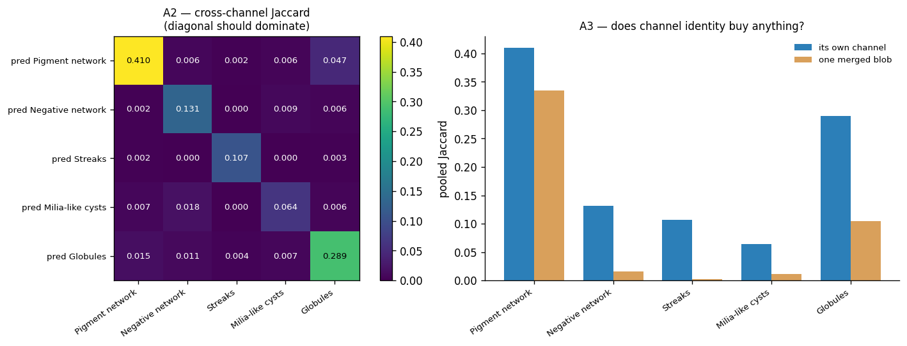
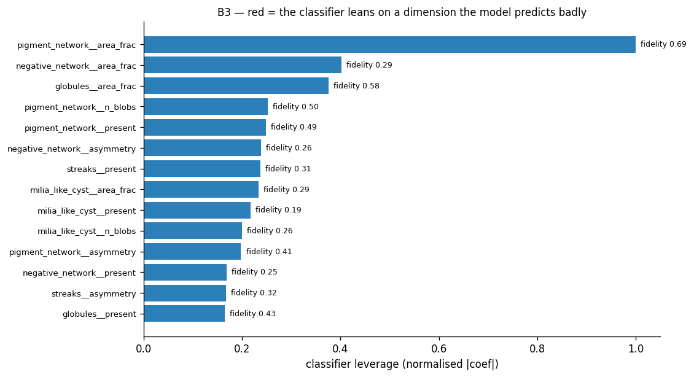

# Skin Lesion Analysis — ISIC 2018

   

Deep learning on dermoscopy images for the [ISIC 2018 "Skin Lesion Analysis Towards Melanoma Detection"](https://challenge.isic-archive.com/landing/2018/) challenge, covering all three official tasks: lesion **boundary segmentation**, **attribute detection**, and **disease classification**.

> **This was my first deep learning project** (2021–2022). I've kept it as it was built — including the parts that didn't work — and added an honest write-up of what I'd do differently now. See [What I'd do differently](#what-id-do-differently).
>
> **Externally scored, 2026:** the same lineage of models now sits on the live [ISIC MILK10k leaderboard](https://challenge.isic-archive.com/leaderboards/milk10k/) at **macro F1 0.422, rank 133/164**, up from 0.304 on the first attempt. [How](#beyond-2018--a-scored-entry-on-a-live-benchmark) — including a calibration attempt that made things worse and got thrown out.

## Results

Measured numbers, taken from the notebooks' own saved outputs:

| ISIC task | Notebook | Model | Metric | Score |
|---|---|---|---|---|
| **Task 1** — lesion segmentation | [`task1`](task1-lesion-segmentation.ipynb)<br>[](https://colab.research.google.com/github/teddy8023mars/Skin-lesion-classification/blob/main/task1-lesion-segmentation.ipynb) | ResNet50-U-Net | Jaccard / Dice / Accuracy | **0.793** / 0.873 / 0.933 |
| **Task 2** — attribute detection | [`task2`](task2-attribute-detection.ipynb)<br>[](https://colab.research.google.com/github/teddy8023mars/Skin-lesion-classification/blob/main/task2-attribute-detection.ipynb) | ResNet50 multi-label U-Net | pooled Jaccard (macro) | **0.200** |
| **Bonus** — concept bottleneck | [`cbm`](concept-bottleneck-pipeline.ipynb) | 20 named concepts → logistic regression | Balanced acc / macro-F1 / AUC | 0.207 / 0.212 / 0.731 |
| **Task 3** — lesion classification | [`task3`](task3-lesion-classification.ipynb)<br>[](https://colab.research.google.com/github/teddy8023mars/Skin-lesion-classification/blob/main/task3-lesion-classification.ipynb) | EfficientNetB0 @224 (2026)<br><sub>2021: small CNN @32 — leaked</sub> | Balanced acc / macro-F1 / AUC | **0.703** / 0.655 / 0.944 |

<sub>Task 1 also reports recall 0.906 / precision 0.871. Task 2 is the unweighted mean of five per-attribute pooled Jaccards — see [the metric trap](#a-metric-trap-in-the-task-2-literature) before comparing it to other papers. Task 3's headline accuracy is 0.801, but the majority-class baseline is 0.669, so balanced accuracy is the honest figure; **melanoma sensitivity is only 0.419** and that is the number that matters. The 2021 notebook's widely-quoted 61.5% is invalid — it leaked. The concept bottleneck trades roughly half the balanced accuracy for an explanation — [why, and what would fix it](#bonus--a-concept-bottleneck-and-what-it-costs). Full metrics: [`assets/task2-results.json`](assets/task2-results.json), [`assets/task3-results.json`](assets/task3-results.json), [`assets/cbm-results.json`](assets/cbm-results.json).</sub>

---

## Task 1 — Lesion boundary segmentation

Pixel-wise segmentation of the lesion region: the first step of any automated dermoscopy pipeline.

**Encoder ablation.** Rather than accepting one architecture, I trained and compared six:



U-Net (from scratch), VGG16-U-Net, VGG19-U-Net, DenseNet121-U-Net, Double U-Net, and ResNet50-U-Net — all on the same image, against ground truth. Plain U-Net and ResNet50-U-Net produce a spurious second blob here; the ImageNet-pretrained VGG/DenseNet encoders are cleaner. ResNet50-U-Net gave the best overall validation scores and became the primary model.

**Hair-removal preprocessing.** Dermoscopy images are full of occluding body hair, which U-Net happily segments as lesion edge. A black-hat morphology + inpainting pass removes it before training (`u_net_with_hair_removal`).

**Other techniques:** combined Dice + binary cross-entropy loss, Jaccard-optimized variant, test-time augmentation (horizontal / vertical / both flips), Dice / IoU / recall / precision tracked per epoch.

## Task 2 — Lesion attribute detection

> **Added in 2026.** Task 2 was skipped when I first built this project — which is why the notebooks used to jump from 1 to 3. It is now implemented **and trained**, on the official 2594-image Task 2 training set (split 1816 / 389 / 389, seed 42), on a free Kaggle P100.

Detect five dermoscopic attributes as **per-pixel binary masks**, using the same input images as Task 1 (hence the `t12` in the dataset paths):

| Attribute | Mask file suffix | Present in training set |
|---|---|---|
| Pigment network | `_attribute_pigment_network.png` | 58.7% of images |
| Globules | `_attribute_globules.png` | 24.4% |
| Milia-like cysts | `_attribute_milia_like_cyst.png` | 26.2% |
| Negative network | `_attribute_negative_network.png` | 7.5% |
| Streaks | `_attribute_streaks.png` | 3.9% |

<sub>Frequencies from Le et al., *TATL: Task Agnostic Transfer Learning for Skin Attributes Detection*, Medical Image Analysis 2022 ([arXiv:2104.01641](https://arxiv.org/abs/2104.01641)).</sub>

**Why this is much harder than Task 1.** A lesion boundary is one large, high-contrast, always-present object. These attributes are faint, tiny, scattered, **co-occurring**, and often absent — streaks appear in under 4% of images. Design consequences:

- **Five independent sigmoids, not softmax.** Attributes co-occur in the same pixel, so this is multi-label segmentation: output shape `(256, 256, 5)`.
- **Loss must fight sparsity.** Combined Dice + binary cross-entropy, with positive weights *measured from the data* in the EDA cell rather than hard-coded.
- **Nearest-neighbour mask resizing.** Bilinear interpolation puts grey fringes on these structures and erases the smallest cysts outright.
- **Pooled Jaccard, not per-image average.** The official metric pools every prediction pixel across the whole dataset, precisely because many images have no positive pixels for a given attribute — per-image averaging would be undefined or misleading. The notebook implements the official pooled version.
- **Per-attribute threshold search.** Heavy positive weighting makes 0.5 the wrong operating point; thresholds are fitted on validation only.

### Measured result

Trained on a free Kaggle P100, ResNet50-U-Net encoder, 30 epochs, ~30 minutes. Scored on the held-out 389-image test split with per-attribute thresholds fitted on validation only:



| Attribute | Threshold | **This U-Net** | 2018 winner | Present in train | Positive pixels |
|---|---|---|---|---|---|
| Pigment network | 0.90 | **0.410** | 0.563 | 58.1% | 4.08% |
| Globules | 0.85 | **0.289** | 0.341 | 22.4% | 0.59% |
| Negative network | 0.95 | **0.131** | 0.228 | 7.3% | 0.25% |
| Streaks | 0.95 | **0.107** | 0.156 | 4.1% | 0.067% |
| Milia-like cysts | 0.90 | **0.064** | 0.171 | 26.8% | 0.215% |
| **Macro average** | | **0.200** | **0.292** | | |

Three things worth extracting from this:

**1. Threshold tuning was worth +37%.** Macro Jaccard at the default 0.5 was 0.146; with per-attribute thresholds fitted on validation it is 0.200. Every fitted threshold landed in 0.85–0.95, far from 0.5 — a direct consequence of positive weights up to 50× pushing the sigmoid up. A model evaluated at 0.5 here would look much worse than it is.

**2. The difficulty ordering matches the winner's exactly** (pigment network best, milia-like cysts and streaks worst), which says this ranking is a property of the task rather than of the model. Pigment network occupies 4.08% of pixels; streaks 0.067% — a **61× difference in pixel mass**.

**3. "Rare" has two meanings, and the pixel-level one is what hurts.** Milia-like cysts appear in 26.8% of images — far more often than negative network's 7.3% — yet score worst of all five. They are common but *minuscule*: scattered specks totalling 0.215% of pixels. Image-level frequency and pixel-level sparsity are different problems.

**Under-trained, not converged.** Validation dice was still improving at epoch 30 and early stopping never fired, so 0.200 is what 30 epochs bought, not this architecture's ceiling.



### What the model actually learned — and why that matters downstream



Ground truth uses all five colours; the predictions are dominated by one coarse blue (globules) contour tracing roughly the whole lesion, with the fine pigment-network mesh largely missed. (These four are the most densely annotated test images, deliberately picked, so they are not typical — but the direction is real.)

This looked like evidence that the model had learned a coarse "where is the lesion" prior and replicated it across five channels, rather than genuine attribute-texture discrimination — attribute masks mostly sit inside the lesion, so predicting "the whole lesion" already earns a non-trivial Jaccard.

**That hypothesis was tested and refuted.** Three quantitative checks — cross-channel Jaccard, a merged-blob baseline, and PCA of the concept dimensions — all show the five channels are genuinely specialised. See [the fidelity tests](#first-are-the-concepts-actually-concepts). The visual impression came from picking the most densely annotated images plus a real tendency to over-predict extent (a consequence of 50× positive weights), not from channel collapse.

### A metric trap in the Task 2 literature

Published Task 2 numbers are not comparable without knowing how they aggregate across attributes, and papers frequently do not say.

- The **0.292** above is the winner's *unweighted mean of the five per-attribute Jaccards* (Le et al., [arXiv:2104.01641](https://arxiv.org/abs/2104.01641)). That is the same aggregation used for this repo's 0.200, so those two are comparable.
- The official ISIC guidance only specifies pooling **across images** — "computing the Jaccard over all pixels in the set, rather than image-by-image" ([ISIC forum](https://forum.isic-archive.com/t/task-2-evaluation-and-superpixel-generation/417)) — and does not state how the five attributes are combined.
- Other published Task 2 figures sit on a visibly different scale: a multi-task U-Net reports **0.433 for 5th place** ([chvlyl/ISIC2018](https://github.com/chvlyl/ISIC2018)), which cannot be a macro average if the winner's is 0.292. The likely explanation is a single Jaccard pooled over all attributes' pixels at once, which pigment network would dominate (72% of the positive pixels in this test split) — but I could not verify that from a primary source, so it is stated here as an open question rather than a fact.

Takeaway: quote the aggregation, or the number means nothing.

## Task 3 — Disease classification

Seven-class classification over the HAM10000-derived Task 3 set (10,015 images):

| Code | Class | | Code | Class |
|---|---|---|---|---|
| MEL | Melanoma 黑素瘤 | | AKIEC | Actinic keratoses 日光性角化 |
| NV | Melanocytic nevi 痣 | | BKL | Benign keratosis-like 良性角化 |
| BCC | Basal cell carcinoma 基底细胞癌 | | DF | Dermatofibroma 皮肤纤维瘤 |
| | | | VASC | Vascular lesions 血管病变 |



This task has two versions in this repo. The 2021 one is kept because its failure is instructive.

### The 2021 version, and the bug that invalidates its number

The original notebook trained a small `Sequential` CNN on **32×32** images and reported **61.5%** test accuracy. Two problems, both discovered in 2026 while auditing:

**It leaked.** `resample(replace=True, n_samples=500)` upsampled each class by *duplication*, and only afterwards did `train_test_split` run. DF has 60 original images and VASC 80 — duplicated to 500 each, the same physical image necessarily lands in both train and test. **That 61.5% is contaminated and is not a valid baseline for anything.**

**And 32×32 was the wrong call.** The diagnostic signal in dermoscopy *is* fine texture — pigment network, streaks, border irregularity. Thirty-two pixels destroys precisely the information the task depends on. `EfficientNetB0` was imported in that notebook but never wired up; transfer learning was the plan that didn't get finished.

### The 2026 version

Same data, done properly: **EfficientNetB0 at 224×224**, ImageNet-pretrained, two-phase (frozen head → fine-tune top 60 layers with BatchNorm kept frozen), stratified 70/15/15 split on all 10,015 images with saved split ids, sqrt-inverse class weights instead of duplicate-resampling, label smoothing 0.05.

| Metric | Score | |
|---|---|---|
| Accuracy | **0.801** | majority-class baseline (always NV) = 0.669 |
| Balanced accuracy | **0.703** | mean per-class recall — the number comparable to a balanced test set |
| Macro F1 | **0.655** | |
| Macro ROC-AUC (ovr) | **0.944** | |
| ECE (10-bin) | **0.041** | well calibrated |

Per class, on the 1,503-image test split:

| Class | Support | Sensitivity | Specificity | F1 |
|---|---|---|---|---|
| MEL | 167 | **0.419** | 0.951 | 0.464 |
| NV | 1006 | 0.892 | 0.841 | 0.905 |
| BCC | 77 | 0.857 | 0.974 | 0.733 |
| AKIEC | 49 | 0.592 | 0.982 | 0.558 |
| BKL | 165 | 0.685 | 0.948 | 0.651 |
| DF | 17 | 0.706 | 0.989 | 0.533 |
| VASC | 22 | 0.773 | 0.995 | 0.739 |

**Read accuracy with suspicion.** On this natural distribution, always predicting NV scores 0.669. Raw accuracy is therefore a weak signal; balanced accuracy (0.703) and macro-F1 (0.655) are the honest summaries, and macro-AUC 0.944 says the ranking is much better than the argmax decision suggests.

### The number that actually matters is the worst one

**Melanoma sensitivity is 0.419** — 97 of 167 melanomas missed. Specificity is 0.951, which in cancer screening is the wrong side of the trade: a false negative is a missed cancer, a false positive is a biopsy. Melanoma is also the class most confusable with NV and BKL.

Taking argmax is the wrong decision rule for this problem. A screening deployment would instead fit the operating point to a required sensitivity (say ≥0.95 for MEL) and accept the resulting false-positive load — a different model output, not a different model.

### Abstention works, and that is the useful finding

The model is well calibrated (ECE 0.041), which makes "I don't know" a usable output:

| Abstain if confidence < | Coverage | Accuracy on kept |
|---|---|---|
| — (no abstention) | 100% | 0.801 |
| 0.60 | 74.3% | 0.901 |
| 0.80 | 53.0% | 0.951 |
| 0.95 | 21.2% | 0.994 |

Routing the least-confident cases to a human buys 95% accuracy on half the volume, or 99% on a fifth. For triage that is worth more than squeezing another point of top-1 accuracy.

### What fixing it taught me (about my own 2026 code)

The first 2026 run scored only 0.635 — barely above the leaky 0.615 — because of a bug I introduced: phase 2's `ModelCheckpoint` restarted its best-score tracking from scratch and **overwrote phase 1's better weights** (val 0.787) with a worse fine-tuned model (val 0.645). Fine-tuning had also been degrading the backbone because BatchNorm layers were left trainable, so their statistics were being rewritten on small batches. Freezing BN and keeping one checkpoint per phase, then explicitly choosing the winner, turned 0.635 into 0.801.

The lesson generalises: a two-phase training script needs *one* notion of "best", and a plausible-looking marginal improvement is often a bug rather than a ceiling.

---

## Bonus — a concept bottleneck, and what it costs

*Added 2026, trained on free Kaggle GPU. Notebook: [`concept-bottleneck-pipeline.ipynb`](concept-bottleneck-pipeline.ipynb) · raw metrics: [`assets/cbm-results.json`](assets/cbm-results.json)*

The three ISIC tasks never talked to each other. Chaining them gives a model that states its reasoning in the vocabulary a dermatologist already uses:

```
image → [Task 2 attribute model] → 20 named concepts → [logistic regression] → diagnosis + rationale
```

The bottleneck is 5 attributes × 4 scalars each — `present`, `area_frac`, `n_blobs` (multifocality), `asymmetry` — so every one of the 20 dimensions has a name and a clinical reading. The classifier is deliberately a logistic regression: its coefficients *are* the explanation.

**A structural constraint, measured rather than assumed:** Task 1-2 images (`ISIC_0000000`–`ISIC_0016072`, 2,594) and Task 3 / HAM10000 (`ISIC_0024306`–`ISIC_0034320`, 10,015) share **zero image ids** — different contributing institutions. So concepts for Task 3 images must be *predicted*, never read from ground truth. That is also the real deployment setting: no clinician hands you attribute annotations at inference time.

### First: are the "concepts" actually concepts?

A bottleneck whose concepts don't mean what they claim is a black box wearing a costume. Looking at the Task 2 predictions qualitatively, I suspected exactly that — that the model had learned a coarse "where is the lesion" prior and replicated it across five channels. Three tests on the Task 2 held-out split, the only place ground-truth concepts exist:



**The suspicion was wrong.** All three tests refute channel collapse:

| Test | Result |
|---|---|
| **Cross-channel Jaccard** — does predicted channel *j* explain GT attribute *k*? | Diagonal wins **5/5**. Pigment network scores 0.410 on its own channel; the best other channel manages 0.015. Off-diagonals are 0.000–0.047 throughout. |
| **"One merged blob"** — union all five predictions, score against each GT | Macro Jaccard drops 0.200 → **0.094**. Streaks collapses 0.107 → 0.0025 (43×), negative network 0.132 → 0.016. Channel identity carries most of the signal. |
| **PCA of the five `area_frac` dims** | Ground truth PC1 = 22.9%, predicted PC1 = **24.9%**; mean pairwise \|r\| 0.043 vs 0.056. The predicted concepts have almost the same correlational structure as ground truth. |

Why the qualitative read misled me: those four figures were the *most densely annotated* test images, deliberately picked, and the model genuinely **over-predicts presence** — globules positive rate 0.42 against a ground-truth 0.27, milia-like cysts 0.41 against 0.26. That is the expected consequence of positive weights up to 50×. Over-predicted extent is not channel collapse, but one thick contour dominates the eye. *Qualitative figures generate hypotheses; they cannot test them.*

Fidelity is nevertheless only **moderate** — presence agreement (Cohen's κ) 0.19–0.49, continuous agreement (Spearman ρ) 0.21–0.69, best for pigment network, worst for milia-like cysts. The concepts are real but noisy.

### Then: the bottleneck's accuracy cost

Trained on the **identical test split** the black-box EfficientNet used, so this is a like-for-like comparison:

| Metric | Black box (EfficientNetB0) | Concept bottleneck | Δ |
|---|---|---|---|
| Accuracy | 0.801 | 0.637 | −0.164 |
| **Balanced accuracy** | 0.703 | **0.207** | **−0.497** |
| Macro F1 | 0.655 | 0.212 | −0.443 |
| Macro AUC | 0.944 | 0.731 | −0.213 |
| Melanoma sensitivity | 0.419 | 0.258 | −0.162 |

**The bottleneck largely fails, and the failure is specific.** Balanced accuracy 0.207 with AKIEC recall 0.000, BKL 0.042, VASC 0.046: it predicts NV for almost everything. Its 0.637 accuracy is *below* the always-predict-NV baseline of 0.669 — an accuracy figure that means nothing on its own.

Four diagnosed causes, in order of how much I think each matters:

**1. The concept set is incomplete for this label set.** Pigment network, streaks and globules are the diagnostic vocabulary of *melanocytic* lesions — nevi and melanoma. BCC is diagnosed on arborising vessels, AKIEC on a strawberry pattern, VASC on vascular lacunae. **None of those is expressible in these five attributes**, so for those classes the bottleneck contains no relevant information at all. This is a property of the concept set, not a failure of the method: the near-parity Koh et al. report for CBMs assumes concepts sufficient for the task.

**2. 20 dimensions vs 1280.** The black box classifies on EfficientNet's 1280-d feature vector; the bottleneck compresses the same image into 20 numbers by construction. Some loss is the entire point, but this is a hard ceiling.

**3. Moderate concept fidelity compounds.** κ 0.19–0.49 concepts feed a linear model, and the errors stack.

**4. The signal concentrates in two attributes.** Zeroing a whole attribute and re-predicting (a sensitivity analysis — Task 3 images have no attribute ground truth, so this is *not* Koh-style ground-truth correction) changes: pigment network **13.7%** of predictions, globules 9.9%, milia-like cysts 3.3%, negative network 2.9%, streaks **1.7%**.

### Leverage × fidelity — which dimensions are load-bearing *and* unreliable



Cross-referencing what the classifier leans on against how well each dimension is actually predicted:

| Concept dimension | Leverage | Fidelity |
|---|---|---|
| `pigment_network__area_frac` | **1.000** | 0.686 ✅ highest fidelity too |
| `negative_network__area_frac` | 0.401 | **0.295** ⚠️ second pillar, weak |
| `globules__area_frac` | 0.375 | 0.576 |
| `pigment_network__n_blobs` | 0.253 | 0.499 |
| `milia_like_cyst__present` | 0.218 | **0.187** ⚠️ lowest fidelity of all 20 |

The most load-bearing dimension is also the best-predicted one, which is reassuring. But the second pillar has fidelity 0.295 — the model is partly reasoning from a quantity it measures poorly. **That combination is what produces explanations that sound plausible and rest on wrong evidence**, and it is invisible to any accuracy metric. Surfacing it is the concrete argument for building the bottleneck at all.

### The honest verdict

Interpretability was not free here — it cost half the balanced accuracy. But the diagnosis is actionable rather than mysterious:

- **Extend the concept set** to cover non-melanocytic lesions (vascular patterns, arborising vessels, strawberry pattern). Without this, no amount of tuning helps BCC / AKIEC / VASC.
- **Train Task 2 to convergence** — it was still improving at epoch 30 — to lift concept fidelity above κ ≈ 0.5.
- **Consider a hybrid / residual CBM**: keep a side-channel from image features so accuracy is recoverable, accepting that the side-channel is exactly the part that cannot be explained.

⚠️ Not clinically validated, not a medical device. The geometric qualifiers in particular (`asymmetry` and `n_blobs` as proxies for *atypical* / *irregular*) are load-bearing in the rationale text and have **not** been reviewed by a dermatologist.

---

## Beyond 2018 — a scored entry on a live benchmark

*Added 2026. Raw metrics: [`assets/milk10k-results.json`](assets/milk10k-results.json), [`assets/milk10k-run2-training.json`](assets/milk10k-run2-training.json)*

ISIC 2018 closed in 2018, but ISIC runs **[live leaderboards](https://challenge.isic-archive.com/leaderboards/live/)** that still accept submissions. The current one is **MILK10k**: 11-class lesion diagnosis from *paired* dermoscopic and clinical close-up views, scored by **macro F1**. It is a harder and more honest test than a self-chosen split, so I entered it twice.

| | Approach | Official score | Rank |
|---|---|---|---|
| Run 1 | EfficientNetB0 @224, two-view, argmax softmax | **0.304** | 154 / 164 |
| Run 2 | EfficientNetV2S @288 + MONET features + TTA | **0.422** | **133 / 164** |

<sub>For scale: leaderboard top is 0.705, median 0.471. This is a real, externally scored result — not a number I computed on my own split.</sub>

### What the +0.118 came from

Held-out macro F1 went 0.369 → 0.443; the leaderboard moved further, 0.304 → 0.422.

**Selecting on the right metric.** Run 1 kept the checkpoint with the best validation *accuracy* while the leaderboard scores *macro F1*. Those are opposing objectives — accuracy rewards BCC (48% of lesions), macro F1 weights all eleven classes equally. Run 2 selects on validation macro F1 directly. This was the cheapest fix and probably the largest single one.

**Using the tabular data that ships with the task.** The official supplement includes seven **MONET concept probabilities** — ulceration/crust, hair, *vasculature/vessels*, *erythema*, pigmentation, dermoscopy fluid, skin markings — plus age, sex and anatomic site. Vasculature and erythema are precisely the evidence BCC, VASC and INF are diagnosed on, and they are exactly what the ISIC 2018 attribute vocabulary *cannot* express (see [the concept bottleneck's failure](#bonus--a-concept-bottleneck-and-what-it-costs) — the same gap, now filled from a different direction). A 17-dimensional dense branch concatenated with the two image encoders.

**Skin tone is excluded from the model's inputs** even though it is available, and used only for the audit below. Conditioning a diagnosis on skin tone would bake a demographic prior into the prediction.

**Stronger encoder, more pixels, TTA.** EfficientNetV2S at 288px instead of B0 at 224px, shared across both views; 4× flip TTA.

### The probability format was worth 0.019, and the calibration was worth −0.027

The scorer thresholds at **≥0.5**. Run 1 submitted plain softmax, so **174 of 786** held-out lesions had no class above the bar and scored as misses even when the argmax was right.

The obvious fix — fit per-class priors and a temperature on validation — **backfired**:

| | Validation | Held-out |
|---|---|---|
| Before calibration | 0.381 | **0.425** |
| After calibration | 0.421 ✅ | **0.398** ❌ |

Eleven free parameters against a 786-lesion validation set where some classes have single-digit counts. Validation gained 0.041; the held-out split lost 0.027. Textbook overfitting, and it would have been invisible without a third split.

So I scored four probability formats on the *same* held-out split and picked by evidence:

| Format | Thresholded macro F1 | argmax macro F1 | Rows below 0.5 |
|---|---|---|---|
| Raw softmax | 0.4248 | 0.4434 | 174 |
| Temperature only (T=0.9) | 0.4335 | 0.4434 | 146 |
| Priors + temperature | 0.3981 | 0.4160 | 125 |
| **Confident argmax** | **0.4434** | 0.4434 | **0** |

The winner reaches exactly the argmax ceiling, because it is the only format that leaves nothing on the wrong side of 0.5. The two knobs are not equivalent and that is the point: **temperature cannot change the argmax** (one parameter, monotone per class, so it only decides whether the chosen class clears the bar), while **priors move the decision itself** — and priors are what overfit. Worth noting too that the temperature sweep chose T=0.9 on validation while the held-out optimum sat near 0.5: this validation set cannot reliably tune even *one* parameter.

None of this is score-gaming. Our decision rule is argmax; a flat softmax simply prevents the scorer from seeing that decision.

### Skin-tone fairness audit

This closes the gap the retrospective called the largest remaining one. MILK10k ships a six-level skin tone label (0 = very dark → 5 = very light), which ISIC 2018 does not.

| Skin tone | Held-out lesions | macro F1 | Melanomas | MEL sensitivity |
|---|---|---|---|---|
| 0 (very dark) | 3 | *withheld* | — | — |
| 1 | 14 | 0.347 | 3 | 1.000 |
| 2 | 86 | 0.488 | 19 | 0.632 |
| 3 | 441 | 0.427 | 30 | 0.700 |
| 4 | 171 | 0.485 | 11 | 0.364 |
| 5 (very light) | 71 | 0.329 | 5 | 0.200 |

Metrics are withheld wherever fewer than five lesions fall in a stratum — a point estimate on n=3 is not a result, and reporting one would be worse than reporting nothing.

**The finding is about the data, not the model.** Training lesions by skin tone: `0: 6 · 1: 105 · 2: 506 · 3: 3174 · 4: 1066 · 5: 383`. The darkest tone is **6 of 5240 lesions — 0.1%**. So the model has essentially never seen very dark skin, and this benchmark **cannot measure** how it performs there. That is not fixable by reweighting a loss; it is a data-collection problem, and it matters because melanoma carries higher mortality in darker-skinned patients precisely because it is caught later.

The per-tone numbers that *are* reportable should be read with matching caution. Melanoma sensitivity appears to fall as skin gets lighter (1.000 at tone 1 down to 0.200 at tone 5), which inverts the usual concern — but those two strata contain 3 and 5 melanomas respectively. **This is noise, and I am not going to present it as a finding.** The two strata with enough melanomas to say anything (tones 2 and 3, n=19 and n=30) sit at 0.63 and 0.70, and even those are thin.

What an audit like this is genuinely for: it makes the absence of evidence explicit instead of letting an aggregate number imply coverage that does not exist.

---

## What I'd do differently

Written in hindsight, several years and a few production systems later. Where the 2026 pass actually fixed something, it says so — the rest are still open.

**1. ✅ The classifier was the weak half.** The 2021 model was a `Sequential` CNN on **32×32** images. Thirty-two pixels destroys exactly the fine texture dermoscopy diagnosis depends on. `EfficientNetB0` was imported and never wired up. *Fixed in 2026:* transfer learning at 224×224 took balanced accuracy from an invalid 0.615 to a measured **0.703**, macro-AUC to **0.944**.

**2. ✅ I reported the number I wanted, not the number I had.** An earlier version of this README claimed "87% accuracy" and "EfficientNet". Neither was true of the code: the saved output said 0.615, and the architecture was the small CNN. *Corrected 2026* — and then the 0.615 itself turned out to be invalid (see next).

**3. ✅ Resampling didn't just blunt the imbalance, it leaked.** `resample(replace=True, n_samples=500)` ran **before** `train_test_split`, so duplicated minority images (DF: 60 originals → 500; VASC: 80 → 500) appeared in train and test simultaneously. This is the single most serious defect in the original project, and I didn't notice it for five years. *Fixed in 2026:* stratified split on original images only, sqrt-inverse class weights instead of duplication, split ids committed.

**4. ✅ Segmentation, attributes and classification never met.** Three notebooks, no data flow between them, even though chaining them is the entire point of doing all three tasks. *Addressed in 2026* by the [concept bottleneck pipeline](concept-bottleneck-pipeline.ipynb): Task 2's attributes become an interpretable middle layer that Task 3's diagnosis is predicted *from*, so the model states its reasoning in dermoscopic vocabulary. See [What the AI era changes](#what-the-ai-era-changes).

**5. ⬜ Still no cross-validation and no error bars.** Single split, `random.seed` set in one notebook but not the other. Every 2026 number here is also a single stratified split with a fixed seed — better documented, but still a point estimate. A stratified k-fold would turn "0.703" into "0.703 ± something", and without the ±, a 2-point difference between models means nothing.

**6. ⬜ Argmax is the wrong decision rule for cancer screening.** Both versions report the argmax class. But **melanoma sensitivity is 0.419** — 97 of 167 melanomas missed — against specificity 0.951. That trade-off is backwards for screening: a false negative is a missed cancer, a false positive is a biopsy. The right approach is to fit the operating point to a required sensitivity (≥0.95 for MEL) and accept the false-positive load. Same model, different output.

**7. ⬜ Notebooks were the wrong home for the reusable parts.** Metrics, data pipelines and model builders are copy-pasted between notebooks with small divergences. The 2026 Kaggle training scripts repeated this. Extracting them into a module — with unit tests on the metric functions — would make the ablation trustworthy, since every variant would provably share one evaluation path. Concretely: the `dice_macro` used here scores ~1.0 on an empty channel correctly predicted empty, so it is inflated by absent attributes and is only a training signal, never a score. A unit test would have made that obvious immediately instead of requiring a code comment.

**8. ✅ No fairness audit — now done, and the result is about the data.** ISIC 2018 carries no skin-tone label, so this could not be measured on it at all. MILK10k does, and [the audit](#skin-tone-fairness-audit) shows the darkest tone accounts for **6 of 5240 training lesions (0.1%)** — the model has essentially never seen very dark skin and the benchmark cannot measure how it performs there. Reweighting a loss does not fix that; it is a data-collection problem. Strata below five lesions are reported as withheld rather than as point estimates.

---

## What the AI era changes

The 2021 framing was "train a segmenter, train a classifier". Several things that were research topics then are commodities now, and one of them reframes this whole project.

**Task 2 turns out to be the valuable half.** In 2018, attribute detection was a niche sub-task — the one I skipped. But its five attributes *are* the clinical vocabulary of dermoscopy, which makes them exactly what a **concept bottleneck model** needs: predict human-interpretable concepts, then diagnose *from those concepts*, so the output is "melanoma, because irregular streaks and negative network" rather than an unexplained label plus a heatmap. That is implemented in [`concept-bottleneck-pipeline.ipynb`](concept-bottleneck-pipeline.ipynb).

There is a hard constraint worth recording, because it is easy to assume otherwise: **Task 1-2 and Task 3 images do not overlap at all.** Measured, not assumed — Task 1-2 ids run `ISIC_0000000`–`ISIC_0016072` (2,594 images) and Task 3 is HAM10000 at `ISIC_0024306`–`ISIC_0034320` (10,015), from different contributing institutions. Zero shared ids. So concepts for Task 3 images must be *predicted*, never read from ground truth — which is also the real deployment setting, since no clinician hands you attribute annotations at inference time.

And a caution the Task 2 results already raise: the attribute model appears to partly encode "where is the lesion" rather than true attribute texture (see [above](#what-the-model-actually-learned--and-why-that-matters-downstream)). A bottleneck built on concepts that don't mean what they claim is interpretable in name only, which is why the pipeline measures **concept fidelity** and not just downstream accuracy.

Other directions, deliberately listed rather than implemented:

- **Foundation models instead of ImageNet.** SAM / MedSAM make from-scratch U-Net a weak baseline for Task 1; DINOv2-class backbones or dermatology-specific foundation models would beat ImageNet-pretrained ResNet50/EfficientNet on a dataset this size.
- **Vision-language models for the long tail.** Rather than resampling or weighting DF (60 images) and VASC (80), zero-/few-shot text-prompted classification sidesteps the requirement for enough examples per class.
- **Diffusion-generated rare classes** — viable now, but only for training data, with validation and test kept strictly real, because whether synthetic dermoscopy preserves diagnostic texture is unresolved.
- **Uncertainty as a first-class output.** The abstention curve above is a crude version; conformal prediction would give prediction sets with coverage guarantees.
- **Metadata and report generation.** HAM10000 ships age, sex and lesion site, all unused here. Image → attributes → structured clinical narrative is a natural next layer.
- **Core ML export.** The 2021 "future work" said "lightweight models for mobile"; that is now a small amount of work, and on-device inference is where a tool like this would actually be used.

---

## Setup

```bash
pip install -r requirements.txt
```

The notebooks are written for **Google Colab with a GPU runtime** (they mount Google Drive and use `google.colab` helpers). `requirements.txt` pins the 2021-era TensorFlow 2.5 stack they were built against — see the comments in that file for the two version traps.

**Data** is not redistributed here. See [`data/README.md`](data/README.md) for the download link and the exact directory layout the notebooks expect.

Run order: Task 1 → Task 2 → Task 3, which are independent of each other. The concept-bottleneck notebook is the exception: it consumes a trained Task 2 attribute model.

The 2026 results were produced on free Kaggle GPU (P100) rather than Colab — Task 2 in ~30 min, Task 3 in ~15 min. Raw metrics are committed as [`assets/task2-results.json`](assets/task2-results.json) and [`assets/task3-results.json`](assets/task3-results.json).

## License

MIT — see [LICENSE](LICENSE).
