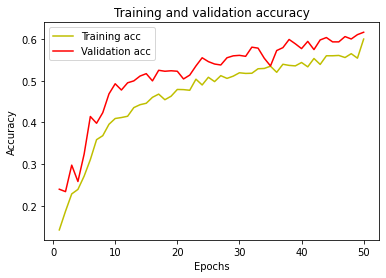
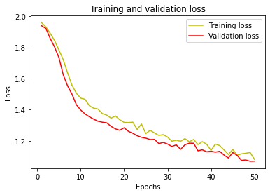
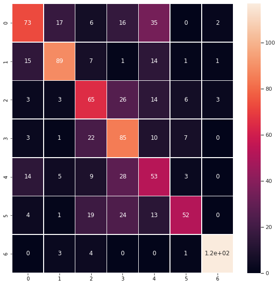
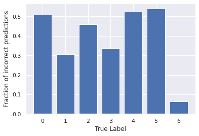

# Skin Lesion Analysis — ISIC 2018

   

Deep learning on dermoscopy images for the [ISIC 2018 "Skin Lesion Analysis Towards Melanoma Detection"](https://challenge.isic-archive.com/landing/2018/) challenge, covering all three official tasks: lesion **boundary segmentation**, **attribute detection**, and **disease classification**.

> **This was my first deep learning project** (2021–2022). I've kept it as it was built — including the parts that didn't work — and added an honest write-up of what I'd do differently now. See [What I'd do differently](#what-id-do-differently).

## Results

Measured numbers, taken from the notebooks' own saved outputs:

| ISIC task | Notebook | Model | Metric | Score |
|---|---|---|---|---|
| **Task 1** — lesion segmentation | [`task1`](task1-lesion-segmentation.ipynb)<br>[](https://colab.research.google.com/github/teddy8023mars/Skin-lesion-classification/blob/main/task1-lesion-segmentation.ipynb) | ResNet50-U-Net | Jaccard / Dice / Accuracy | **0.793** / 0.873 / 0.933 |
| **Task 2** — attribute detection | [`task2`](task2-attribute-detection.ipynb)<br>[](https://colab.research.google.com/github/teddy8023mars/Skin-lesion-classification/blob/main/task2-attribute-detection.ipynb) | Multi-label U-Net | — | *implementation only, not yet trained* |
| **Task 3** — lesion classification | [`task3`](task3-lesion-classification.ipynb)<br>[](https://colab.research.google.com/github/teddy8023mars/Skin-lesion-classification/blob/main/task3-lesion-classification.ipynb) | Small CNN (7-class) | Test accuracy | **0.615** |

<sub>Task 1 also reports recall 0.906 / precision 0.871. Task 3's 61.5% is on 7 highly imbalanced classes (random baseline ≈ 14%); see [What I'd do differently](#what-id-do-differently) for why this number is lower than it should be.</sub>

---

## Task 1 — Lesion boundary segmentation

Pixel-wise segmentation of the lesion region: the first step of any automated dermoscopy pipeline.

**Encoder ablation.** Rather than accepting one architecture, I trained and compared six:


U-Net (from scratch), VGG16-U-Net, VGG19-U-Net, DenseNet121-U-Net, Double U-Net, and ResNet50-U-Net — all on the same image, against ground truth. Plain U-Net and ResNet50-U-Net produce a spurious second blob here; the ImageNet-pretrained VGG/DenseNet encoders are cleaner. ResNet50-U-Net gave the best overall validation scores and became the primary model.

**Hair-removal preprocessing.** Dermoscopy images are full of occluding body hair, which U-Net happily segments as lesion edge. A black-hat morphology + inpainting pass removes it before training (`u_net_with_hair_removal`).

**Other techniques:** combined Dice + binary cross-entropy loss, Jaccard-optimized variant, test-time augmentation (horizontal / vertical / both flips), Dice / IoU / recall / precision tracked per epoch.

## Task 2 — Lesion attribute detection

> **Added in 2026.** Task 2 was skipped when I first built this project — which is why the notebooks used to jump from 1 to 3. It's now implemented, but **not yet trained**: every cell is written and Colab-ready with outputs cleared, and no result numbers are filled in anywhere.

Detect five dermoscopic attributes as **per-pixel binary masks**, using the same input images as Task 1 (hence the `t12` in the dataset paths):

| Attribute | Mask file suffix | Present in training set |
|---|---|---|
| Pigment network | `_attribute_pigment_network.png` | 58.7% of images |
| Globules | `_attribute_globules.png` | 24.4% |
| Milia-like cysts | `_attribute_milia_like_cyst.png` | 26.2% |
| Negative network | `_attribute_negative_network.png` | 7.5% |
| Streaks | `_attribute_streaks.png` | 3.9% |

<sub>Frequencies from Le et al., *TATL: Task Agnostic Transfer Learning for Skin Attributes Detection*, Medical Image Analysis 2022 ([arXiv:2104.01641](https://arxiv.org/abs/2104.01641)).</sub>

**Why this is much harder than Task 1.** A lesion boundary is one large, high-contrast, always-present object. These attributes are faint, tiny, scattered, **co-occurring**, and often absent — streaks appear in under 4% of images. Design consequences:

- **Five independent sigmoids, not softmax.** Attributes co-occur in the same pixel, so this is multi-label segmentation: output shape `(256, 256, 5)`.
- **Loss must fight sparsity.** Combined Dice + binary cross-entropy, with positive weights *measured from the data* in the EDA cell rather than hard-coded.
- **Nearest-neighbour mask resizing.** Bilinear interpolation puts grey fringes on these structures and erases the smallest cysts outright.
- **Pooled Jaccard, not per-image average.** The official metric pools every prediction pixel across the whole dataset, precisely because many images have no positive pixels for a given attribute — per-image averaging would be undefined or misleading. The notebook implements the official pooled version.
- **Per-attribute threshold search.** Heavy positive weighting makes 0.5 the wrong operating point; thresholds are fitted on validation only.

**Calibration before you look at any number.** The Task 2 *winner* scored **0.292 average Jaccard** (pigment network 0.563 down to streaks 0.156) — about a third of what a plain U-Net achieves on Task 1. A macro Jaccard of 0.1–0.2 from a single un-pretrained U-Net here is a reasonable outcome, not a broken model. The notebook says so explicitly, with sources, so that the eventual result gets read correctly.

## Task 3 — Disease classification

Seven-class classification over the HAM10000-derived Task 3 set:

| Code | Class | | Code | Class |
|---|---|---|---|---|
| MEL | Melanoma 黑素瘤 | | AKIEC | Actinic keratoses 日光性角化 |
| NV | Melanocytic nevi 痣 | | BKL | Benign keratosis-like 良性角化 |
| BCC | Basal cell carcinoma 基底细胞癌 | | DF | Dermatofibroma 皮肤纤维瘤 |
| | | | VASC | Vascular lesions 血管病变 |


**Class imbalance.** NV dominates the dataset by an order of magnitude. I resampled every class to a fixed count (tried 500 / 1000 / 3000 per class) so the model couldn't win by always predicting NV.

**Specificity, not just accuracy.** In cancer screening a false negative means a missed diagnosis, so I implemented specificity as a custom Keras metric and tracked it alongside accuracy.

<table>
<tr>
<td></td>
<td></td>
</tr>
</table>

Training and validation curves track each other closely over 50 epochs — no overfitting, but both plateau early, which is the tell that the model is underpowered rather than over-trained.

**Error analysis.** A confusion matrix and a per-class error-rate chart show *where* it fails, not just how often:

<table>
<tr>
<td></td>
<td></td>
</tr>
</table>

One class is learned well (~6% error) while several sit near 50% — the imbalance is suppressed, not solved.

---

## What I'd do differently

Written in hindsight, several years and a few production systems later.

**1. The classifier is the weak half, and I know why now.** The model that produced the 61.5% above is a small `Sequential` CNN trained on **32×32** images. Thirty-two pixels is far too small for dermoscopy — the diagnostic signal (pigment network, streaks, asymmetry of border) is exactly the fine texture that resolution destroys. `EfficientNetB0` is imported in the notebook but never actually wired up; transfer learning at 224×224 was the plan I didn't finish. That single change is likely worth more than every other tweak in this repo combined.

**2. I reported the number I wanted, not the number I had.** An earlier version of this README claimed "87% accuracy" and "EfficientNet". Neither was true of the code — the saved output says 0.615, and the architecture was the small CNN. I'd rather show 61.5% with an explanation than a number I can't reproduce. *(Corrected 2026.)*

**3. Resampling is the crudest fix for imbalance.** Upsampling minority classes by duplication invites memorization. Class-weighted loss, focal loss, or heavier augmentation on rare classes would all be better; a stratified k-fold would also give an honest error bar instead of one train/test split.

**4. No cross-validation, no seeds, no fixed splits.** Single split, and `random.seed` set in one notebook but not the other. Today I'd pin every seed and commit the split indices, because "0.615" without a variance estimate isn't really a result.

**5. Segmentation and classification never met.** They're two separate notebooks. The obvious pipeline — segment the lesion, crop to it, then classify — was never built, even though it's the whole point of doing both tasks.

**6. Notebooks were the wrong home for the reusable parts.** Metrics, the data pipeline, and the model builders are copy-pasted between notebooks with small divergences. Extracting them into a small module would have made the ablation trustworthy, since each variant would provably share the same evaluation code.

---

## Setup

```bash
pip install -r requirements.txt
```

The notebooks are written for **Google Colab with a GPU runtime** (they mount Google Drive and use `google.colab` helpers). `requirements.txt` pins the 2021-era TensorFlow 2.5 stack they were built against — see the comments in that file for the two version traps.

**Data** is not redistributed here. See [`data/README.md`](data/README.md) for the download link and the exact directory layout the notebooks expect.

Run order: Task 1 → Task 2 → Task 3. They are independent; no notebook consumes another's output.

## License

MIT — see [LICENSE](LICENSE).
